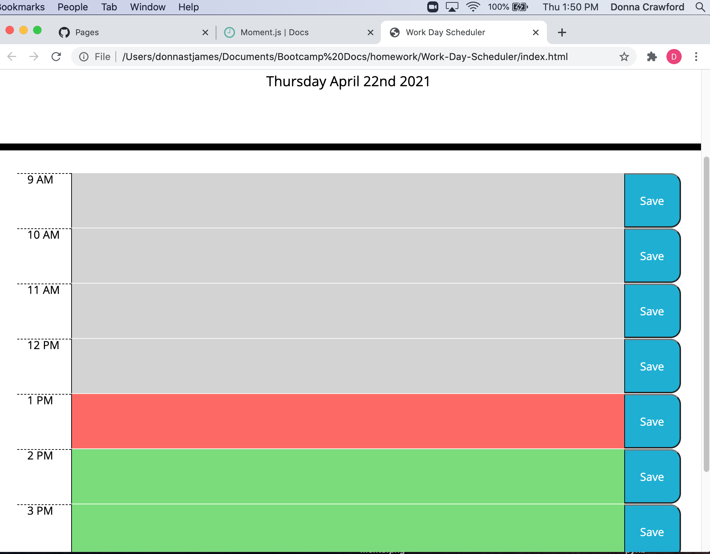

# Work-Day-Scheduler

This is a simple appointment book application that allows a user to save descriptions/plans for each hour block of the current business day.  I used [Moment.js](https://momentjs.com/) on blocks of code that require 'time' functionality.  If the user clicks to save typed in descriptions for a particular hour, they will persist after refreshing the page.  In order to remove a saved entry, the user must delete the text from the description field, then click on the 'Save' button.

Below is a screenshot of the application:

Github link to the application:
https://donnastjames.github.io/Work-Day-Scheduler/